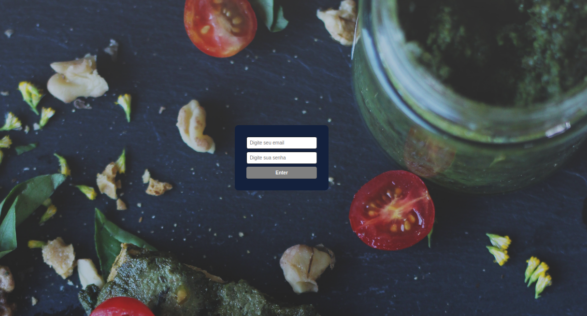
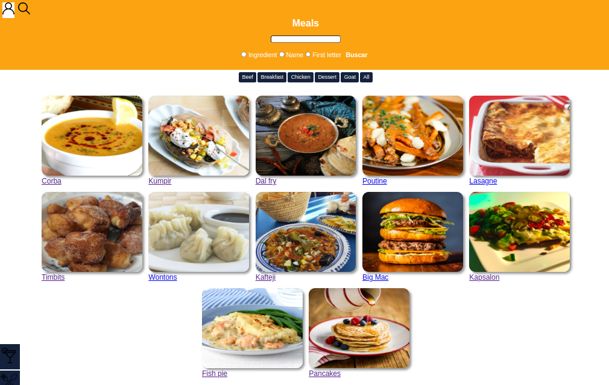

# APP Recipes

O APP Recipes é um aplicativo de receitas que foi desenvolvido com o uso de Hooks e Context API. Inicialmente, era um projeto de Front-End que consumia serviços de uma API externa. Com o tempo, o expandimos para se tornar um aplicativo full-stack completo, abrangendo serviços de banco de dados, um back-end e um front-end, todos configurados de forma eficiente via Docker.

Embora algumas rotas ainda dependam de requisições a uma API externa, a maior parte da aplicação agora funciona diretamente com o banco de dados criado utilizando o MySQL e o framework Sequelize. Este aplicativo é capaz de:

- Permitir a visualização, pesquisa, filtragem, marcação e acompanhamento do progresso do cozimento de receitas de comida e bebida.

O banco de dados foi estruturado para abranger duas APIs diferentes, uma para alimentos e outra para bebidas, proporcionando uma experiência completa e rica em conteúdo culinário.

<div align="center">


</div>

## Execute localmente:
- Primeiro clone o repositório em sua máquina

```
git clone git@github.com:wesleymktd/project-app-recipes.git
```

- Vá para o diretório do projeto
```
cd project-app-recipes
```

- Instale as dependências

```
npm run install:apps
```
- Inicialize os containers com o docker compose
```
npm run compose:up
```
## Vizualize a aplicação e teste as funcionalidades:
- Verifique em qual porta a aplicação está rodando (provavelmente o app estará rodando em localhost:3000)
```
docker logs app_frontend_full_stack
```
## Autores:
 - [@wesleymktd](https://github.com/wesleymktd)
 - [@GusVF](https://github.com/GusVF)
 - [@edudias1972](github.com/edudias1972)
 - [@patriciaEliseu](https://github.com/patriciaEliseu)

## Principais Tecnologias utilizada:
- React;
- React Router;
- API request;
- JavaScript;
- Context-API;
- Hooks;
- Css;
- Mysql2
- Sequelize
- docker
